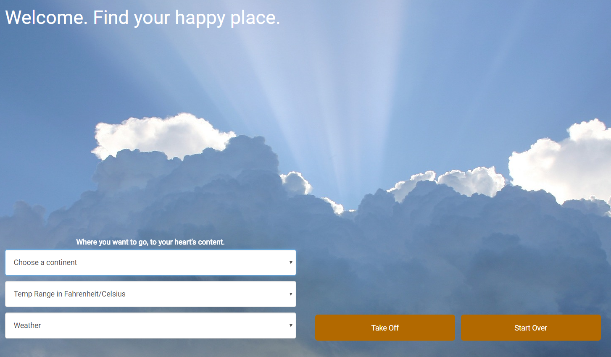
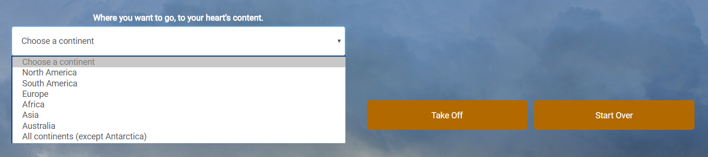
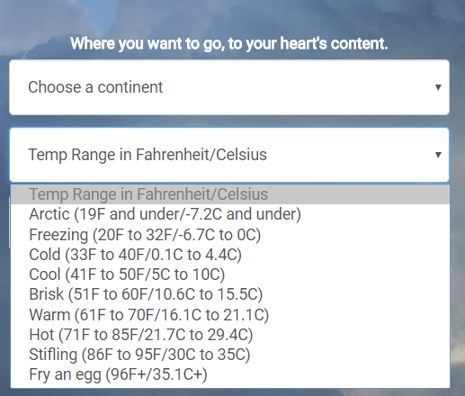
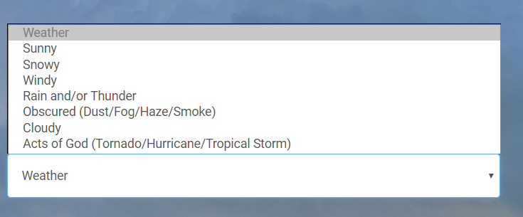
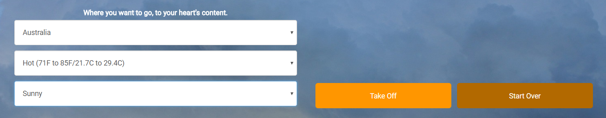
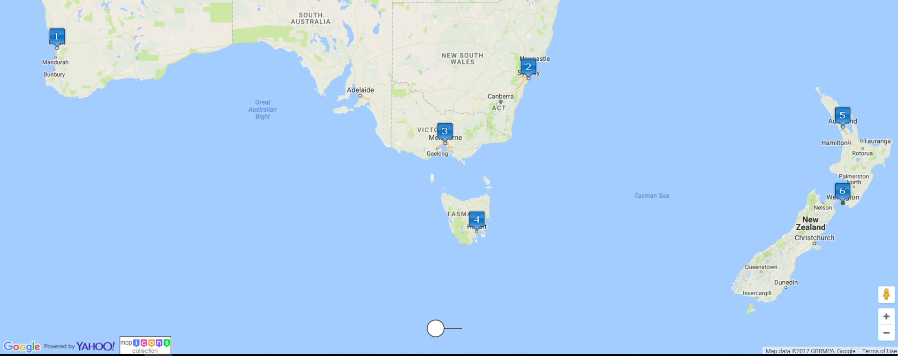
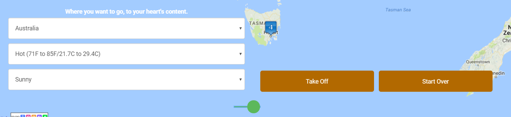
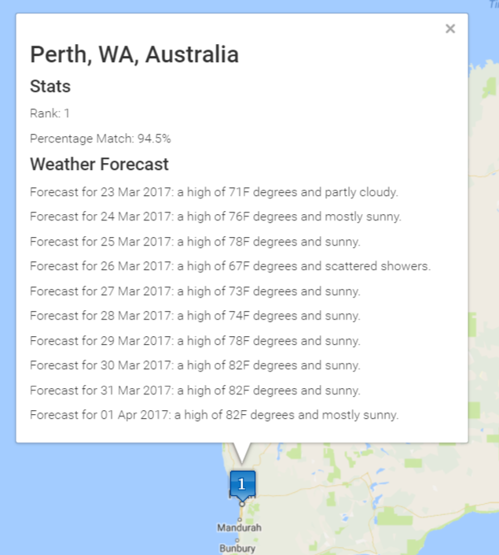

# Find Your Happy Place #

An API mashup app that combines Google Maps API V3 and Yahoo Weather to filter locations by weather and temperature based on a 10-day forecast.

## Summary ##

This app is a tool to solve what I think is every cube-dweller's idle day dream. If I could drop everything right this instant and fly out to some exotic locale, where would I  go? How would I narrow down where to go?  My app answers that question by giving the user the ability to find those locations based on criteria from weather type, temperature range, and continent. I took a list of the 100 best cities in the world to visit from Lonely Planet's 100 Best Cities in the World (online source [here](http://www.listchallenges.com/lonelyplanets100bestcitiesintheworld/), print source [here](https://books.google.com/books?id=wGCGLEOVs8C)).

## Technology Used ##

I used HTML5, CSS3, Javascript, Google Maps API V3, Yahoo Weather API, Map Icons (to display numbered markers), and Ti-Ta-Toggle (for my toggle switch).

## App Use ##

Simply select the criteria you want to use to search for your happy place with the three dropdown menus on the right and click "Take Off" to be taken to a Google Map populated with ranked markers. Each marker displays the name of the city and country, it's rank, percentage matched, and the 10-day forecast for that location. The more closely that location matches matches the criteria you selected, the higher the percentage match and the higher the rank.

Landing page showing three dropdown menus and two buttons.

Select which continent you want to limit your search to.

Select temperature band.

Select weather type.

With all three criteria selected, click "Take Off."

All results show up on numbered markers denoting the rank of each location. The higher the rank, the better the match.

Click the white toggle button to reveal the menu. Select new criteria to search again.

Clicking on a marker reveals some stats and the 10-day forecast for that city.
